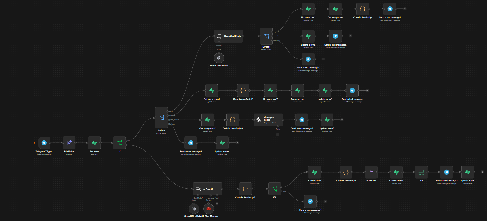
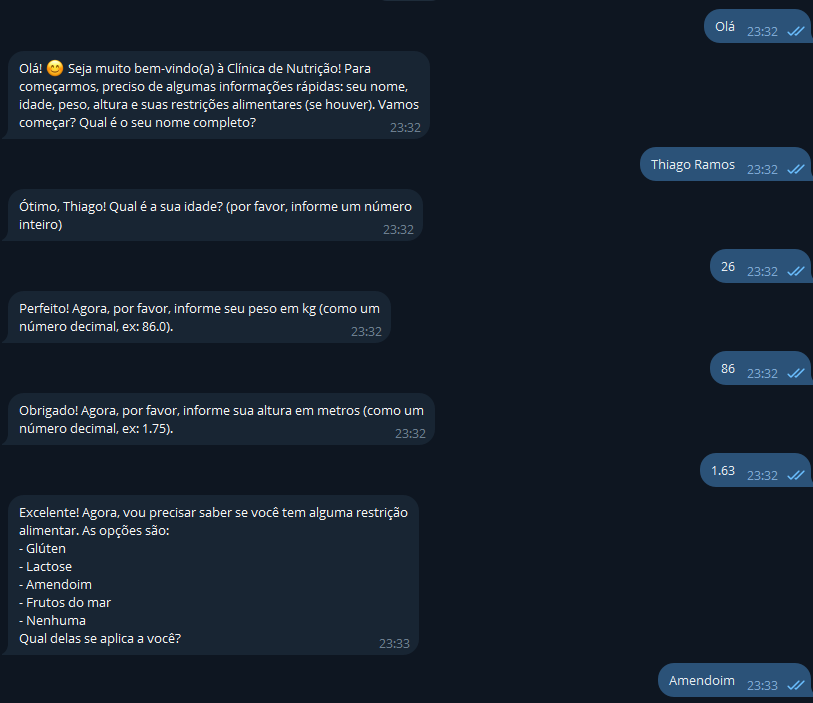
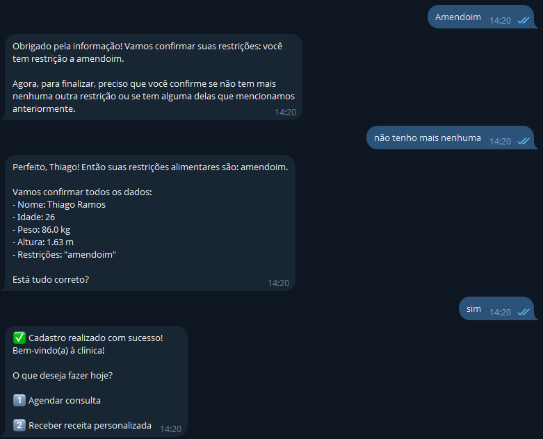
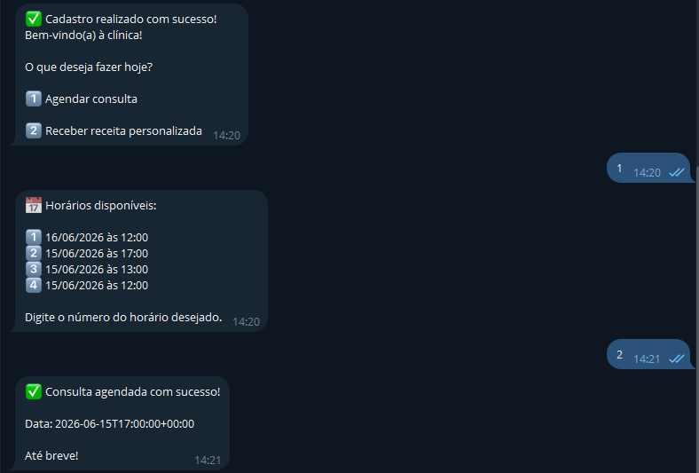
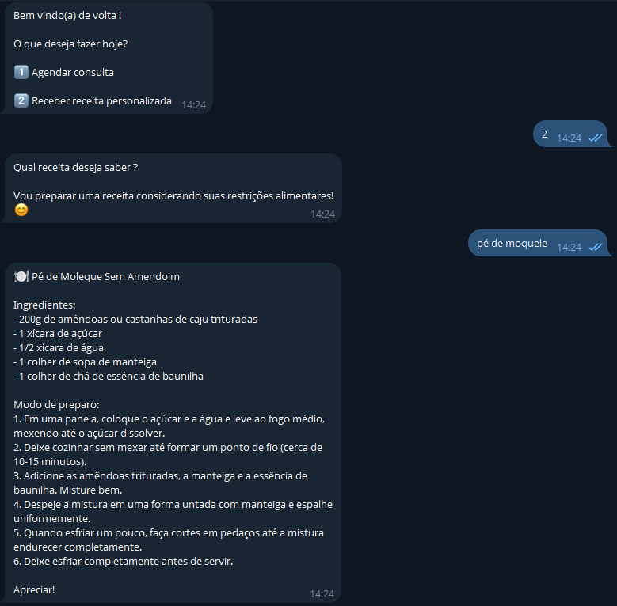

# 🥗 Agente Nutricionista — n8n + Telegram

Assistente virtual de nutrição via Telegram, construído com n8n. Gerencia cadastro de clientes, agendamento de consultas e geração de receitas personalizadas com IA.

---

## 📸 Preview

### Workflow no n8n


### Bot em funcionamento no Telegram

**Cadastro**


<br/><br/>


<br/>

**Consulta**



<br/>

**Receita**



---

## 🛠️ Stack

| Tecnologia | Uso |
|-----------|-----|
| **n8n** | Orquestração do workflow |
| **Telegram Bot API** | Interface com o cliente |
| **OpenAI** | LLM para cadastro, classificação e receitas |
| **Supabase** | Banco de dados (clientes, consultas, histórico) |
| **Redis** | Memória de sessão durante o cadastro |

---

## 🔄 Fluxo Geral

```
Telegram Trigger
    └── Edit Fields
        └── Get Row (Supabase) → verifica se cliente existe
            ├── [NÃO CADASTRADO] → Fluxo de Cadastro
            └── [CADASTRADO] → Switch de Intenções
```

---

## 📋 Fluxo de Cadastro (cliente novo)

O agente coleta os dados do cliente via conversa natural com memória de sessão.

```
AI Agent (OpenAI + Redis)
    └── Code JS → valida dados coletados
        └── If cadastro completo?
            ├── [SIM] → Create Row (Supabase)
            │           └── Code JS → Split Out
            │               └── Create Row 2 → Limit
            │                   └── Send Message → "Cadastro concluído!"
            │                       └── Update Row (Supabase)
            └── [NÃO] → Send Message → solicita dados faltantes
```

---

## 🎛️ Switch de Intenções (cliente cadastrado)

O LLM classifica a mensagem do cliente e direciona para o fluxo correto.

| Intenção detectada | Ação |
|-------------------|------|
| `menu` / `agenda` | Agendamento de consulta |
| `menu` / `receita` | Solicitação de receita |
| `consulta` | Histórico de consultas |
| `gerar receita` | Geração de receita personalizada |
| `fallback` | *(em desenvolvimento)* |

---

## 📅 Agendamento de Consulta

```
Basic LLM Chain (OpenAI) → classifica intenção "agenda"
    └── Update Row (Supabase) → registra intenção
        └── Create Many Rows (Supabase) → salva horários
            └── Code JS
                └── Send Message → confirmação ao cliente
```

---

## 🍽️ Solicitação de Receita (menu)

```
Basic LLM Chain (OpenAI) → classifica intenção "receita"
    └── Update Row 5 (Supabase)
        └── Send Message → pergunta qual receita o cliente deseja
```

---

## 📂 Consulta de Histórico

```
Get Many Rows (Supabase) → busca consultas do cliente
    └── Code JS
        └── Update Row 2 → Update Row 3 (Supabase)
            └── Create Row 1 (Supabase)
                └── Send Message → exibe histórico de consultas
```

---

## 🤖 Geração de Receita Personalizada

```
Get Many Rows 2 (Supabase) → busca perfil e histórico
    └── Code JS
        └── Message a Model (OpenAI) → gera receita com base no perfil
            └── Send Message → envia receita ao cliente
                └── Update Row 6 (Supabase) → registra receita gerada
```

---

## ⚙️ Pré-requisitos

- Conta no [n8n](https://n8n.io) (self-hosted ou cloud)
- Bot do Telegram criado via [@BotFather](https://t.me/BotFather)
- Projeto no [Supabase](https://supabase.com) com as tabelas configuradas
- Instância Redis acessível pelo n8n
- Chave de API da [OpenAI](https://platform.openai.com)

---

## 🗄️ Tabelas Supabase (sugeridas)

| Tabela | Descrição |
|--------|-----------|
| `clientes` | Dados cadastrais dos usuários |
| `consultas` | Agendamentos e histórico |
| `receitas` | Receitas geradas pela IA |
| `agenda_disponivel` | Horários disponíveis para consulta |

---

## 🚀 Como usar

1. Clone ou importe o workflow `.json` no seu n8n
2. Configure as credenciais: Telegram, OpenAI, Supabase e Redis
3. Ative o workflow
4. Inicie uma conversa com seu bot no Telegram

---

## 📌 Status

- [x] Cadastro com IA e memória de sessão
- [x] Agendamento de consultas
- [x] Consulta de histórico
- [x] Geração de receitas personalizadas
- [ ] Fallback (em desenvolvimento)
- [ ] Cancelamento de consultas
